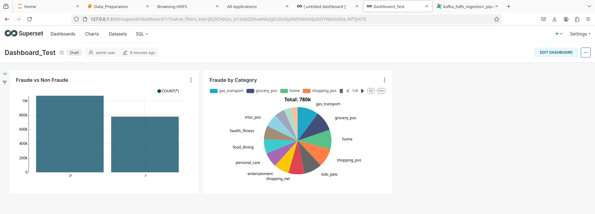
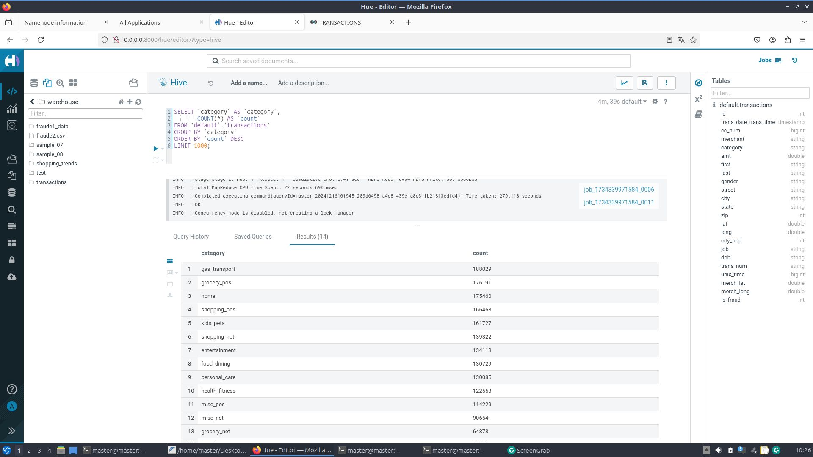
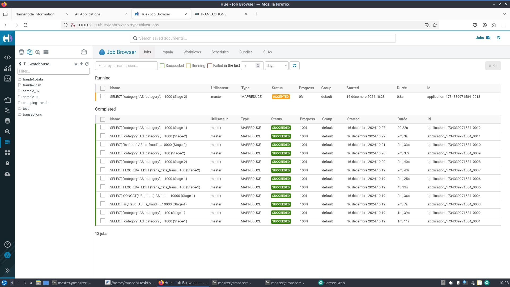
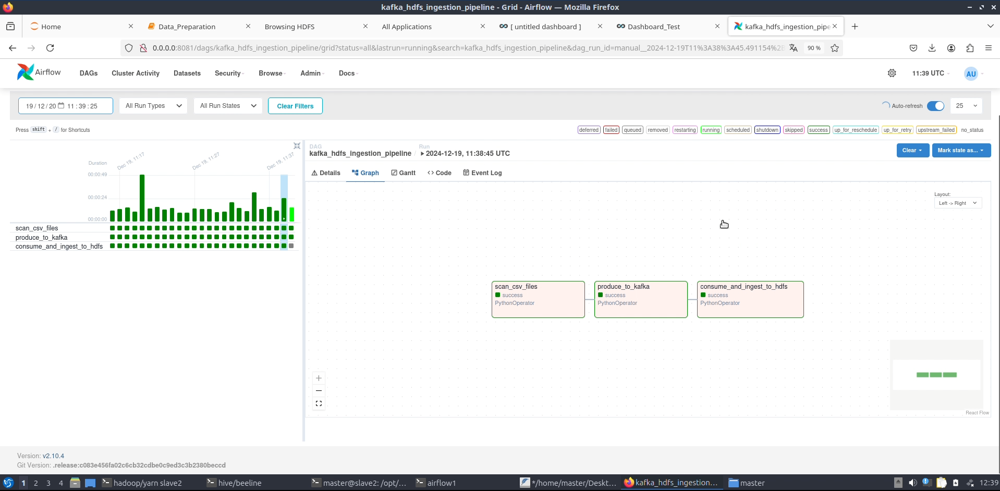

# 🚀 Big Data Pipeline for Real-Time Banking Transaction Analysis

## Kafka | Hadoop (HDFS) | Hive | Airflow | Superset | Hue | Zookeeper

---

## 📸 Aperçu du Projet
🔍 Ce projet académique met en place un pipeline Big Data permettant l'ingestion, le traitement, l'analyse et la visualisation de données de transactions bancaires en temps réel.


### Technologies clés :
- **Kafka** – Ingestion en temps réel
- **HDFS (Hadoop)** – Stockage distribué
- **Hive** – Analyse SQL des données stockées
- **Airflow** – Orchestration du pipeline
- **Hue** – Gestion et requêtage SQL sur Hive
- **Superset** – Visualisation et création de dashboards interactifs
- **Zookeeper** – Coordination des services Kafka et Hadoop

---

## 📂 Architecture du Projet

### Flux de données :
1. Dépôt de fichiers CSV dans un dossier surveillé  
2. Kafka ingère les fichiers et transmet leurs chemins  
3. Airflow consomme les fichiers et les ingère dans HDFS  
4. Hive charge les fichiers depuis HDFS vers des tables SQL  
5. Hue permet des requêtes SQL pour analyser les données  
6. Superset crée des visualisations dynamiques et des dashboards  

---

## 🎯 Objectifs du Projet
- Automatiser l’ingestion et le traitement des données massives
- Gérer efficacement le stockage des fichiers via Hadoop HDFS
- Analyser les transactions grâce à Hive et SQL
- Visualiser les résultats via Superset pour détecter des tendances et fraudes bancaires

---

## ⚙️ Technologies Utilisées

| Technologie  | Rôle                                             |
|-------------|--------------------------------------------------|
| **Kafka**   | Streaming et ingestion en temps réel              |
| **HDFS**    | Stockage distribué de fichiers CSV                |
| **Hive**    | Analyse et requêtes SQL sur les données           |
| **Airflow** | Orchestration des tâches et automatisation        |
| **Hue**     | Interface web pour requêtes SQL sur Hive          |
| **Superset**| Visualisation des données et dashboards           |
| **Zookeeper**| Coordination de Kafka et Hadoop                  |

---

## 🛠️ Installation et Déploiement

Le projet est déployé sur un cluster (1 master et 2 slaves). Pour récupérer les configurations nécessaires :
```bash
git clone https://github.com/Dhia-69/TransactionAnalysis_RealTime 
cd TransactionAnalysis_RealTime
```

### Lancement des Services
Consultez le fichier **"Lancement des services.txt"** pour exécuter les services nécessaires.

---

## 📊 Exemples de Dashboards et Interaction avec les Technologies
**Dashboard Apache Superset**


**Fonctionalités et verification avec Apache Hue**



**Interface Apache Airflow**


## 🚀 Exécution du Pipeline
1. **Kafka Producer** : Dépose les fichiers CSV dans le dossier surveillé (`~/kafka_ingestion`).
2. **Kafka Consumer** : Consomme les messages Kafka et déplace les fichiers vers HDFS.
3. **Hive** : Charge les fichiers HDFS et met à jour la table Hive.
4. **Superset** : Visualise automatiquement les nouvelles données grâce à la connexion JDBC avec Hive.

---

## 🎥 Démo Vidéo
🔗 [https://drive.google.com/file/d/154iiTMNqWlyOTbEOYxhQxQMX98fD5USk/view?usp=sharing](#)  

## Project by
<a href="https://github.com/Dhia-69/TransactionAnalysis_RealTime/graphs/contributors">
    
</a>
